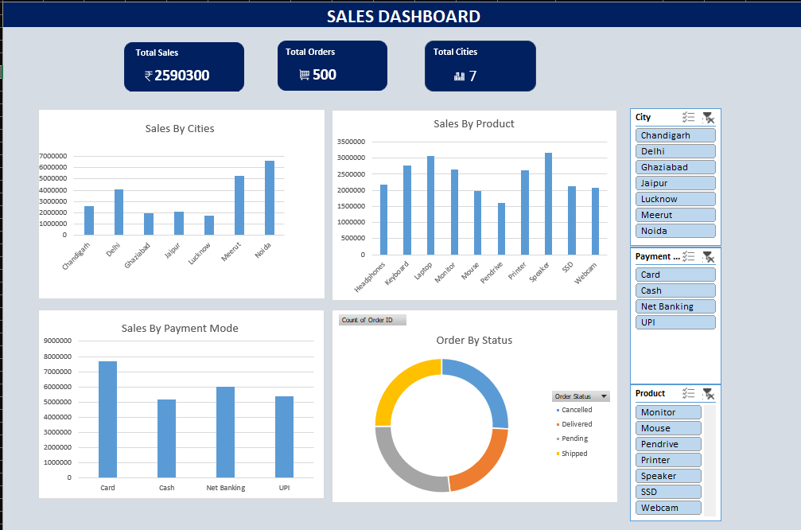

# Sales Dashboard

## Project Overview
An interactive Sales Dashboard created using Microsoft Excel to analyze sales performance across cities, products, orders, and payment methods.

## Objectives
- Analyze total sales and order performance
- Compare sales across different cities
- Identify product-wise sales trends
- Understand payment method distribution
- Present key business insights through an interactive dashboard

## Tools & Technologies
- Microsoft Excel
- Pivot Tables
- Pivot Charts
- Excel Slicers
- Data Cleaning & Analysis

## Dashboard Features
- Total Sales KPI
- Total Orders KPI
- Total Cities KPI
- Sales by City
- Sales by Product
- Interactive City and Payment Method filters

## Dataset
The project uses sales transaction data containing information related to:
- Orders
- Products
- Cities
- Payment Methods
- Sales Amount

## Key Skills Demonstrated
- Data Cleaning
- Data Analysis
- Excel Dashboard Development
- Pivot Table Analysis
- Data Visualization
- Business Insights

## Project Preview
The dashboard provides a visual summary of sales performance and allows users to interact with the data using filters.

## Author
GitHub: [Your GitHub Profile](https://github.com/)
